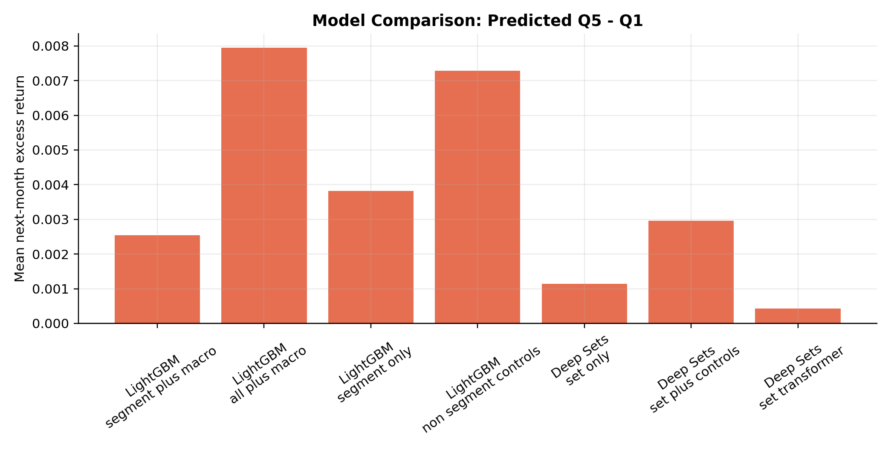
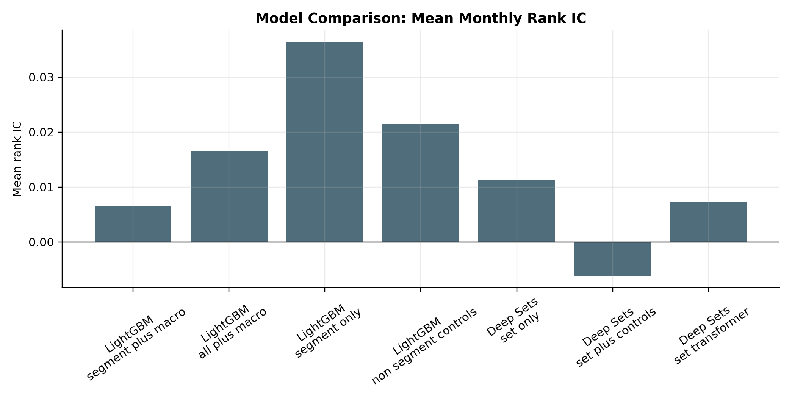
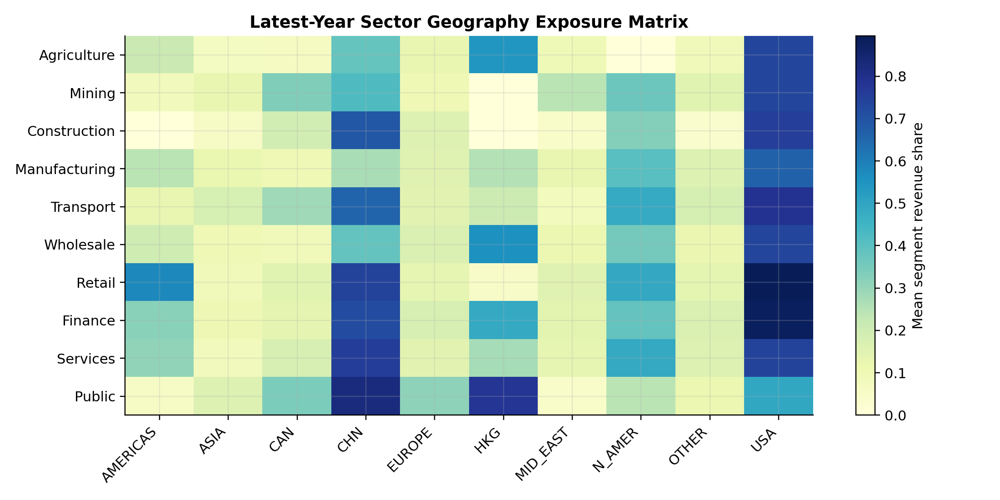
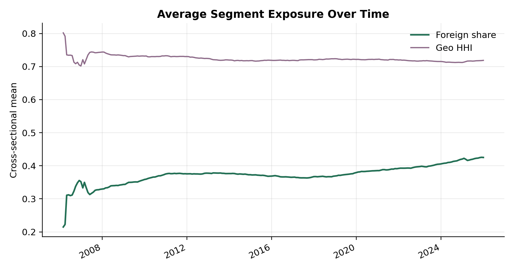
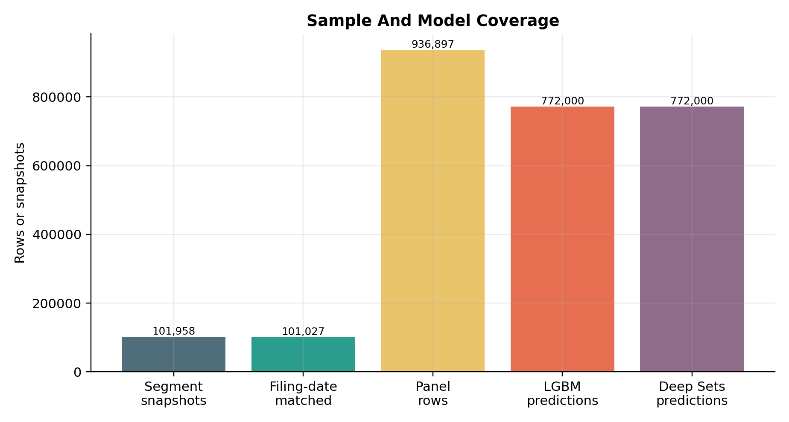
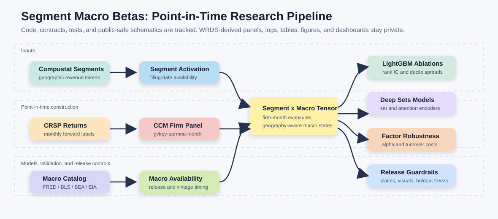
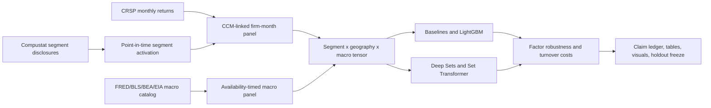

# Segment Macro Betas

<p align="center">
  <b>Research-grade asset-pricing pipeline for testing whether firm geographic segment disclosures reveal macro exposures that predict cross-sectional equity returns.</b>
</p>

<p align="center">
  <b>Python | WRDS-scale data engineering | Point-in-time finance ML | Public-safe code release</b>
</p>

<p align="center">
  <a href="https://github.com/NimaTaheri1378/segment-macro-betas/actions/workflows/ci.yml">
    
  </a>
  <a href="LICENSE">
    
  </a>
  
  
  
</p>

<p align="center">
  
</p>

## Executive Summary

This repository is the public-safe version of a full empirical finance project.
The private pipeline maps Compustat geographic segment disclosures into
firm-month macro exposure tensors, links them to CRSP returns through CCM, and
tests whether segment-implied macro exposures forecast future stock returns.

The project is intentionally framed as a research pipeline, not a live trading
system. The public repository contains source code, configuration files,
documentation, tests, CI, and regeneration scripts. Raw WRDS extracts,
credentials, cluster logs, private Parquet caches, generated figures,
dashboards, and row-level outputs are excluded.

## Visual Results

<p align="center">
  <b>Aggregate development-sample outputs from the full-catalog private run.</b><br>
  These figures summarize model and exposure diagnostics; they do not contain
  raw WRDS extracts or row-level firm/security panels.
</p>

<table>
<tr>
<td width="50%">
  
  <br><b>Long-short spread comparison.</b><br>
  Full-catalog LightGBM variants are compared against segment-only and set-model
  benchmarks using predicted Q5 minus Q1 next-month excess returns.
</td>
<td width="50%">
  
  <br><b>Rank-IC comparison.</b><br>
  Segment-only features rank returns well, while macro-aware variants are
  evaluated for incremental economic spread and factor robustness.
</td>
</tr>
<tr>
<td width="50%">
  
  <br><b>Sector-geography exposure matrix.</b><br>
  The segment pipeline maps firm disclosures into interpretable
  sector-by-geography exposure structure.
</td>
<td width="50%">
  
  <br><b>Exposure evolution.</b><br>
  Aggregate foreign-share and geographic concentration measures summarize how
  disclosed segment exposure changes through the development sample.
</td>
</tr>
<tr>
<td width="50%">
  
  <br><b>Sample and model coverage.</b><br>
  The full development panel, filing-date matched snapshots, and model
  prediction rows are tracked before any holdout evaluation.
</td>
<td width="50%">
  
  <br><b>Pipeline architecture.</b><br>
  Compustat segments, CRSP/CCM returns, and timed macro releases feed the
  tensor, model, robustness, table, and visual layers.
</td>
</tr>
</table>

## Research Question

> Do firms' disclosed geographic business segments reveal macroeconomic
> exposure that helps predict future cross-sectional equity returns after
> enforcing point-in-time availability?

The economic intuition is that segment disclosures expose where firms earn
revenue and operate. If those disclosures map firms to macro states before
returns are realized, then geography-by-segment information can become a
structured source of macro beta variation across firms.

## Headline Private Diagnostics

These are private-run development-sample diagnostics summarized for project
orientation. They are not final paper claims, and the 2026 holdout remains
unopened.

| Item | Development-sample value |
|---|---:|
| Sample window | 2006-2025 |
| Monthly modeling panel rows | 936,897 |
| Joined segment-token rows | 2,811,167 |
| Full macro catalog | 8 FRED/BLS/BEA/EIA series |
| Full-catalog macro feature count | 24 |
| Full-catalog macro coverage | 100% |
| Full-catalog LightGBM Q5-Q1 | 0.795% per month |
| Full-catalog LightGBM Q5-Q1 t-stat | 2.63 |
| Revision-safe FRED initial-release Q5-Q1 | 0.883% per month |
| Revision-safe FRED initial-release Q5-Q1 t-stat | 2.85 |
| 2026 holdout status | Frozen, unopened |

The full FRED/BLS/BEA/EIA catalog uses configured no-lookahead availability
dates, but it is not true historical-vintage evidence for every series. The
revision-safe wording is limited to the included FRED initial-release chain.

## Pipeline Architecture

The Mermaid version below is a text-native rendering of the workflow shown in
the visual results section.



## Visual And Output Layer

The visual layer is implemented as code and verified against private ignored
artifacts. Reviewed aggregate figures are tracked under `docs/figures/`;
row-level WRDS-derived outputs, machine-readable result tables, and private
dashboards are not tracked.

Implemented outputs include:

- Sample and activation coverage figures.
- Sector-geography exposure matrix.
- Foreign-share distribution.
- Exposure time-series diagnostics.
- Model rank-IC and long-short spread comparisons.
- Publication-style model and factor-robustness tables.
- Claim ledger and wording guardrails.
- HTML dashboard and model-card report.
- 2026 holdout protocol freeze manifest.

See `docs/output_inventory.md` for the public-safe inventory of verified
private outputs, tracked public figures, and regeneration commands.

## What Is Public Here

| Component | Included? | Notes |
|---|---:|---|
| Source code and package structure | Yes | `src/segment_macro_betas/` |
| WRDS/schema contracts | Yes | Table and column contracts only |
| Runner scripts | Yes | Require caller-provided project root and allocation id |
| Tests and CI | Yes | Synthetic/code-level checks only |
| Public configs and docs | Yes | No credentials or private paths |
| Reviewed aggregate figures | Yes | README figures only; no row-level data |
| Raw WRDS extracts | No | Excluded by license and policy |
| Private Parquet/model caches | No | Excluded through `.gitignore` |
| Private dashboards and row-level outputs | No | Verified privately, not redistributed |
| API keys or `.env` files | No | `.env.example` only |

## Skills Demonstrated

| Area | What this project demonstrates |
|---|---|
| Data engineering | WRDS schema audit, sharded extracts, cached panel construction |
| Empirical finance | CRSP/Compustat/CCM linking, point-in-time accounting availability |
| Macro data | FRED/BLS/BEA/EIA adapters with availability-date timing metadata |
| Financial ML | Expanding-window LightGBM, rank IC, decile spreads, ablations |
| Deep learning | PyTorch Deep Sets and Set Transformer segment-set diagnostics |
| Backtesting discipline | Turnover-aware portfolios and factor-alpha robustness |
| Research governance | Claim ledger, holdout freeze, revision-safety guardrails |
| Release engineering | Public-safe packaging, secret scans, CI, ignored private artifacts |

## Repository Map

```text
configs/                  Public configs and frozen schema contracts
docs/                     Release notes, methodology, status, output inventory
scripts/                  Amarel/Slurm runners and public safety gates
src/segment_macro_betas/  Research package
tests/                    Synthetic and code-level unit tests
runs/                     Private ignored run logs and manifests
data/                     Private ignored WRDS extracts and caches
artifacts/                Private ignored tables, figures, and dashboards
```

## Public-Safe Checks

Run these before any push:

```bash
python scripts/public_safety_scan.py
python scripts/release_audit.py
python scripts/private_state_audit.py --run-id <private-audit-run-id>
python -m unittest discover -s tests
```

The release audit fails if private data folders are tracked, required release
files are missing, private operational markers appear in public text files, or
data-like outputs such as CSV, Parquet, HTML dashboards, PNG figures, pickles,
database files, spreadsheets, and archives are tracked.

## Reproducing Private Runs

Full reproduction requires authorized WRDS access and private API keys for the
macro providers. Credentials live only in an untracked compute-host `.env`.

On Amarel, set the approved project root and allocation id in the shell before
calling any runner:

```bash
export SMB_PROJECT_ROOT="/path/to/Segment Macro Betas"
export SMB_SLURM_JOB_ID="<approved-allocation-id>"
```

Example runner pattern:

```bash
srun --overlap --jobid="$SMB_SLURM_JOB_ID" --chdir="$SMB_PROJECT_ROOT" \
  --ntasks=1 --cpus-per-task=4 bash scripts/run_visual_pack.sh
```

Core runners:

```text
scripts/run_schema_audit.sh
scripts/run_full_extract.sh
scripts/run_filing_dates_extract.sh
scripts/run_build_panel.sh
scripts/run_macro_engine.sh
scripts/run_macro_tensor.sh
scripts/run_baselines.sh
scripts/run_lgbm_benchmark.sh
scripts/run_segment_set_model.sh
scripts/run_factor_robustness.sh
scripts/run_claim_ledger.sh
scripts/run_publication_tables.sh
scripts/run_visual_pack.sh
```

## Data Safety

Raw and derived WRDS data are not redistributed. This repository is designed as
a research and reproducibility scaffold: it exposes the code, contracts,
tests, and documentation needed to understand and rerun the pipeline, while
keeping licensed data, private logs, credentials, and generated private outputs
outside version control.

## Status

The full proposal-grade implementation has been completed for the development
sample, including schema audit, full WRDS extract, point-in-time panel,
macro tensor, LightGBM, segment-set models, factor robustness, publication
tables, visual pack, claim ledger, and holdout freeze. The 2026 holdout is
frozen but unopened.

See `docs/status.md`, `docs/completion_audit.md`, and `docs/release_notes.md`
for the detailed audit trail.
