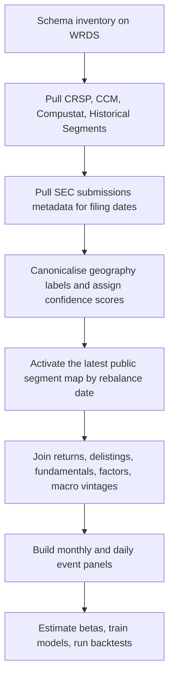
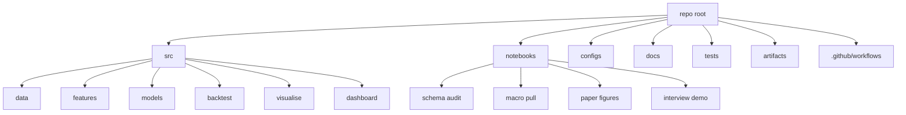
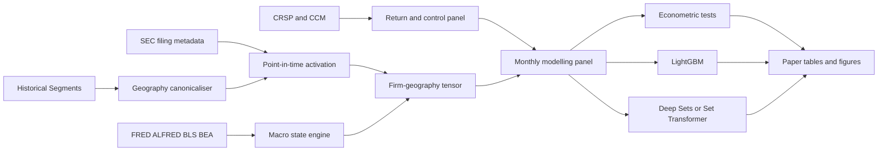
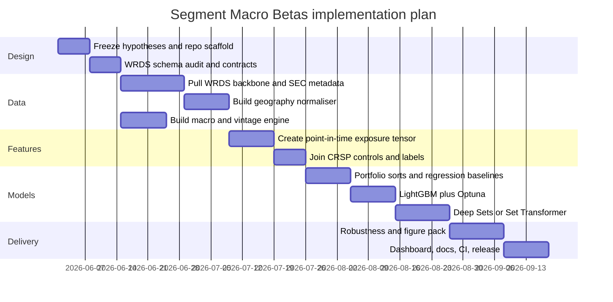

# Segment Macro Betas

## Executive summary

The best single project under your constraints is a **point-in-time equity asset-pricing study of segment-implied macro exposure**, built from **Compustat Historical Segments** plus the standard **CRSP–Compustat–Fama/French** backbone. I would title it **Segment Macro Betas**. The core idea is to reconstruct each firm’s disclosed **geographic revenue map** from the latest publicly available segment filing, merge that map to **real-time macro and FX states** from official sources, and test whether the resulting firm-level exposure measures forecast cross-sectional returns, generate tradable factor-mimicking portfolios, and survive rigorous out-of-sample validation. This route is intentionally different from the uploaded bond, production-network, ownership-network, and SEC Item 1A text directions, and it is also clearly distinct from options-flow and earnings-drift style public portfolio projects. fileciteturn0file0 fileciteturn0file1 fileciteturn0file4 fileciteturn0file5

Economically, the project targets a genuine information-processing wedge: firms disclose where their revenues come from, but the market still has to translate complicated, heterogeneous geographic footprints into exposures to inflation, growth, labour, rates, and FX moves. That mapping is hard, varies through time, and is exactly the sort of structured problem in which standard linear asset-pricing tests, machine-learning models, and set-based deep models can all be made to work together. The feasible data stack is strong: WRDS supports browser, Jupyter, RStudio, cloud, and local Python/R access; the `wrds` Python package explicitly supports `list_libraries()`, `list_tables()`, and `describe_table()`; CRSP’s U.S. Stock Databases provide daily and monthly data with survivor-bias-free history and permanent identifiers; CCM maps CRSP and Compustat identifiers through time; and Kenneth French’s Data Library remains the benchmark factor source, with explicit documentation of the post-2024 CRSP CIZ transition. citeturn6view0turn7view0turn11view0turn12view0turn8view0

The project is also the right kind of difficult. It requires careful point-in-time data engineering, exacting identifier management, rigorous econometrics, and a machine-learning layer that is economically disciplined rather than decorative. It is especially attractive because the natural deep-learning extension is **set-based**: a firm-month is not a fixed-length vector until you force it to be one, but a variable-length **set of segment exposures**, which makes **Deep Sets** and **Set Transformers** unusually well matched to the data-generating structure. That is both methodologically serious and highly legible to a quant hiring manager. citeturn38academia1turn38academia0turn32academia0

My recommended default sample is **January 2006 through December 2025**, with **2026 year-to-date held back** as an untouched forward window for the final dashboard and interview demo. The sample start is practical because ALFRED provides vintages “since 2006”; the holdout is practical because the current date is **27 May 2026**, so leaving 2026 out of development creates a clean last-mile validation window. citeturn14view1

## Project definition and economic logic

The project’s main question should be stated in one sentence at the top of the README:

> **Do point-in-time geographic revenue disclosures imply firm-level macro betas that the market does not fully price immediately?**

That question is sufficiently narrow to produce a coherent paper, but sufficiently rich to support multiple empirical lenses. The economic channel is not “news sentiment” or “order flow”; it is **disclosed operating footprint**. A firm with 35% of sales in the euro area, 20% in China, and 45% in the U.S. should not react to a stronger dollar, weaker European growth, or hotter U.S. inflation in the same way as a purely domestic firm. Yet that exposure is buried in structured disclosures that investors may only partially digest. The project’s contribution is to turn those disclosures into a firm-level state variable and ask whether the state variable prices expected returns. The latest uploaded notes already push hard into customer–supplier graphs, ownership networks, and SEC risk text; this design is different because it is **edge-free, disclosure-structured, and macro-linked** rather than bond-, flow-, graph-, or text-centred. fileciteturn0file4 fileciteturn0file5

A useful conceptual decomposition is:
\[
\text{Segment Macro Beta}_{i,t} = \sum_{g \in \mathcal{G}_{i,t}} w_{i,g,t} \cdot f(M_{g,t}),
\]
where \(w_{i,g,t}\) is firm \(i\)’s disclosed revenue share in geography \(g\) at time \(t\), and \(M_{g,t}\) is a vector of geography-specific macro states such as inflation, labour conditions, policy rates, industrial production, and FX. The novelty is not any one ingredient; it is the **point-in-time construction of the firm–geography exposure tensor** plus the tests that follow from it. Official macro APIs make the second half feasible: FRED exposes releases, series, observations, and vintage dates through its API; ALFRED allows retrieval of the vintage available on a given historical date; BLS and BEA both provide public APIs and release infrastructure. citeturn14view0turn14view1turn15view1turn15view3

The hypotheses should be fixed in advance and should read like an asset-pricing paper, not a data science notebook:

| Hypothesis | Empirical implication | Why it matters |
|---|---|---|
| Underreaction to exposure complexity | Firms with higher segment-implied macro exposure show more predictable next-month and next-quarter returns after the relevant macro state moves | Core expected-return contribution |
| Asymmetric downside transmission | Negative macro shocks produce larger return responses than positive shocks for firms with concentrated foreign exposure | Risk-management relevance |
| Concentration amplifies pricing error | Exposure concentration and disclosure granularity strengthen predictability | Links economics to information complexity |
| Structure-aware ML helps | Set-based models outperform flat tabular models out of sample because they respect variable-length segment inputs | Strong methodological signal for a quant audience |
| Factor form exists | Exposure-sorted or managed portfolios yield persistent long–short spreads and non-zero alphas relative to standard factors | Makes the project recognisably asset-pricing-first |

The project is also credible because adjacent work already shows that **disclosure-derived firm characteristics** can carry cross-sectional return information. A recent study on cyber-risk exposures extracted from firm disclosures reports economically and statistically meaningful return spreads, which supports the broader idea that carefully engineered disclosure-based characteristics can be priced. At the same time, new work on segment disclosures highlights real comparability and completeness challenges, which is precisely why the data-engineering layer here is part of the intellectual contribution rather than just housekeeping. citeturn37academia4turn18academia0

## Data requirements and WRDS extraction

The required core stack is deliberately conservative: use the strongest databases you almost certainly have, and keep everything else optional.

| Layer | Primary source | Role in project | Implementation note |
|---|---|---|---|
| Geographic segment disclosures | **Compustat Historical Segments** | Revenue weights by geography; exposure concentration; disclosure granularity | Assume accessible under your existing entitlements, consistent with the uploaded notes; discover exact schema programmatically |
| Equity returns and implementation variables | **CRSP U.S. Stock Databases** | Daily and monthly returns, prices, shares, volume, delistings, PERMNO/PERMCO | CRSP documents daily/monthly coverage, permanent IDs, and CIZ migration citeturn11view0 |
| Identifier bridge | **CRSP/Compustat Merged** | Historical GVKEY–PERMNO linkage | CCM explicitly maps complex relations through time citeturn12view0 |
| Fundamentals | **Compustat North America** | Size, value, profitability, leverage, investment, issuance, intangible proxies | Pull conservatively lagged accounting controls through CCM citeturn12view0 |
| Benchmark factors | **Kenneth French Data Library** | FF3, FF5, momentum and test-portfolio benchmarking | The library documents the 2025 transition from FIZ to CIZ-based U.S. research returns citeturn8view0 |
| Filing dates and public-availability checks | **SEC EDGAR APIs** | Filing acceptance dates and submission histories | SEC says `data.sec.gov` provides submissions history in real time and needs no API key citeturn40view0 |
| Macro states and vintages | **FRED / ALFRED / BLS / BEA** | Real-time inflation, growth, labour, rates, FX, region/state macro controls | Official programmatic access is documented by all four providers citeturn14view0turn14view1turn15view1turn15view3 |

The first notebook should not be exploratory modelling. It should be a **schema audit notebook** that writes a frozen `schema_map.yml`. That recommendation is essential because WRDS entitlements vary by institution and library names can differ across products and delivery modes; the official Python package explicitly exposes library and table discovery, and WRDS officially supports local Python, Jupyter, RStudio, browser queries, and cloud access. citeturn7view0turn6view0

A robust Python-first discovery pattern is:

```python
import wrds
import yaml

with wrds.Connection() as db:
    libs = db.list_libraries()
    candidates = [lib for lib in libs if "comp" in lib or "crsp" in lib or "seg" in lib]
    print(candidates[:50])

    # Example once the correct libraries are identified
    print(db.list_tables(library="crsp"))
    print(db.describe_table(library="crsp", table="stocknames"))
```

The interface above is directly supported in the official `wrds` package documentation, including `list_libraries()`, `list_tables()`, `describe_table()`, and `get_table()`. citeturn7view0

After discovery, extraction should be YAML-driven and templated. Do **not** hard-code table names until you freeze them. The three first-pass SQL templates should look like this:

```sql
-- geographic segment pull
SELECT
    gvkey,
    datadate,
    <segment_effective_date>,
    <segment_label>,
    <geography_code_or_text>,
    <segment_sales>,
    <segment_assets>,
    <segment_capex>
FROM <segment_geo_table>
WHERE datadate BETWEEN '2004-01-01' AND '2025-12-31';
```

```sql
-- CRSP monthly backbone
SELECT
    permno,
    date,
    ret,
    retx,
    prc,
    shrout,
    vol,
    dlret,
    exchcd,
    shrcd
FROM <crsp_monthly_table>
WHERE date BETWEEN '2004-01-01' AND '2026-05-27';
```

```sql
-- CCM link history
SELECT
    gvkey,
    lpermno AS permno,
    linkdt,
    linkenddt,
    linktype,
    linkprim
FROM <ccm_link_table>;
```

Those templates are intentionally schematic because the exact WRDS schemas are subscription-specific; the correct workflow is to discover and freeze first, then extract. citeturn7view0

Point-in-time discipline matters here at least as much as it did in the uploaded 13F and SEC-text ideas. Your baseline rule should be: **a segment snapshot becomes tradable only when it is publicly available**. If your segment history tables expose a reliable effective or update date, use it. If they do not, merge to SEC filing metadata and activate the exposure one trading day after the associated 10-K or 10-Q acceptance timestamp. The SEC’s EDGAR API supports submissions history by filer, updates in real time, and offers full historical filing metadata through JSON endpoints, which makes this check reproducible and automatable. citeturn40view0

The cleaning sequence should be fixed and documented from day one:



GitHub Markdown natively supports Mermaid diagrams in Markdown files, so this flow should render cleanly in the README and docs site without screenshots or exported images. citeturn27view0

The biggest non-trivial preprocessing task is **geography normalisation**. Segment data are economically rich but not perfectly standardised, and recent work explicitly notes comparability problems in segment disclosures across time and firms. I would therefore build a six-step normalisation layer: exact alias dictionary, country/region canonical table, regex cleaner for boilerplate, fuzzy/embedding candidate matching for unmapped labels, manual review of the top labels by revenue coverage, and a final **mapping confidence score** stored alongside every exposure. That confidence score should later become both a control variable and a robustness filter. citeturn18academia0

## Feature engineering and modelling

The project should create a **firm–geography–macro tensor**, not just a flat characteristic file. In practical terms, each firm-month observation is a set of tuples:
\[
\{(\text{geo\_id}_k,\; \text{revshare}_k,\; \text{assetshare}_k,\; \text{macro}_{k,t},\; \Delta \text{macro}_{k,t},\; \text{fx}_{k,t})\}_{k=1}^{K_{i,t}}.
\]
That representation creates two strong modelling paths: an interpretable tabular path and a structure-aware set-model path. The latter is especially attractive because **Deep Sets** and **Set Transformers** are designed for permutation-invariant inputs, exactly the right inductive bias when a firm’s segment list has variable cardinality and arbitrary ordering. citeturn38academia1turn38academia0

Your feature engineering should happen in four blocks.

| Block | Main variables | Purpose |
|---|---|---|
| Exposure shares | U.S. share, foreign share, Europe share, China/APAC share, LatAm share, top-region share, foreign HHI | Core firm-level state variables |
| Macro interactions | revenue share × local inflation, share × local growth, share × local unemployment, share × local rates, share × FX change | Exposure-sensitive betas |
| Dynamics | quarter-on-quarter changes in shares, new geography disclosures, disappearing geographies, filing-age decay | Information updates |
| Standard controls | log market cap, book-to-market, profitability, investment, leverage, issuance, momentum, reversal, beta, idio-vol, turnover/liquidity | Standard risk and anomaly controls |

The macro side should deliberately mix **real-time slow-moving states** and **high-frequency tradable shocks**. Use ALFRED vintages for monthly state variables so that the backtest only sees the information available at the time. Use daily series for FX, rates, and commodity shocks when building event panels or daily local projections. FRED’s API explicitly exposes releases, release dates, series observations, and vintage dates, while BLS and BEA provide official public APIs for labour and national-accounts data. citeturn14view0turn14view1turn15view1turn15view3

The candidate model list should be hierarchical rather than indiscriminate.

| Model | Role | Strength | Risk | Keep? |
|---|---|---|---|---|
| Exposure-sorted portfolios | First descriptive result | Immediate economic intuition | No control structure | Yes |
| Monthly cross-sectional regressions | Main econometric benchmark | Standard asset-pricing language | Linear only | Yes |
| Exposure-managed factor portfolios | Factor-model view | Produces tradable factor candidates | Depends on sort design | Yes |
| Elastic Net | Sparse tabular benchmark | Shrinkage and interpretability | Misses interactions | Yes |
| LightGBM | Main tabular ML challenger | Fast, scalable, GPU-capable, strong on tabular data | Requires tuning discipline | Yes |
| Deep Sets | GPU extension with correct inductive bias | Natural for unordered segment sets | Less interpretable than linear models | Yes |
| Set Transformer | High-capacity flagship model | Learns interactions across segments | More engineering effort | Yes, as stretch |
| Generic MLP on flat vectors | Weak benchmark only | Simple implementation | Wrong inductive bias for variable-length segment sets | No |

This model ladder is defensible from both the ML and tooling sides. LightGBM’s own documentation emphasises efficiency, low memory use, and support for parallel, distributed, and GPU learning; Optuna’s documentation highlights pruning, dynamic search spaces, and easy parallelisation; and the Deep Sets / Set Transformer papers directly motivate set-structured modelling. citeturn22view0turn22view1turn38academia1turn38academia0

I would make **LightGBM** the main production benchmark and **Set Transformer** the signature deep-learning extension. That gives you one model that a production quant team already respects and one model that clearly shows you understood the mathematical structure of the problem. The model-comparison section of the paper should explicitly ask not only “which model predicts better?” but also “does respecting input structure matter?” citeturn22view0turn38academia0

A clean training configuration table is:

| Component | Recommended setting |
|---|---|
| Prediction horizons | 1 month, 3 months, and daily 5/20-day event windows |
| Rebalance frequency | Monthly |
| Universe | U.S. common stocks with price and liquidity floors |
| Target | Excess return over RF and industry-relative return as robustness |
| Primary optimiser | Optuna |
| Primary loss | Negative monthly rank IC for cross-section; MSE as secondary |
| Neutralisation | Industry-neutral baseline; beta-neutral robustness |
| Feature standardisation | Cross-sectional z-scoring by month for linear models; raw/robust scaled for tree and set models |
| Missingness | Indicator flags + conservative winsorisation rather than row deletion |

A representative Optuna–LightGBM objective can be written as:

```python
def objective(trial):
    params = {
        "learning_rate": trial.suggest_float("learning_rate", 1e-3, 5e-2, log=True),
        "num_leaves": trial.suggest_int("num_leaves", 31, 255),
        "min_data_in_leaf": trial.suggest_int("min_data_in_leaf", 50, 1000),
        "feature_fraction": trial.suggest_float("feature_fraction", 0.5, 1.0),
        "bagging_fraction": trial.suggest_float("bagging_fraction", 0.5, 1.0),
    }
    # train on rolling window; evaluate mean monthly rank IC
    return mean_rank_ic
```

That design is directly aligned with Optuna’s define-by-run API and trial-based optimisation framework. citeturn22view1

For the deep model, the most defensible formulation is a **segment-set encoder**. Each segment becomes one token containing a learned geography embedding, its revenue share, assets share, and the attached macro state vector. A Deep Sets baseline will pool encoded segments through a sum or mean operator; a Set Transformer will use attention to model interactions across the geography set before pooling to a firm-level score. This is more original than throwing an arbitrary transformer at flat panel data, and it is directly justified by the set-modelling literature. citeturn38academia1turn38academia0

## Validation, econometric tests, and evaluation metrics

The project should look like an asset-pricing paper first, so the validation hierarchy matters. The first block should be descriptive and transparent: univariate sorts on foreign-sales exposure, double sorts on exposure × size or exposure × concentration, and cumulative spread plots. The second block should be econometric: monthly cross-sectional regressions with standard controls, factor-model alphas, and state-dependent interactions. The third block should be causal-ish and dynamic: **local projections** or horizon-by-horizon event regressions around large macro/FX shocks. Recent work on inference for local projections provides a strong modern reference point for that design. citeturn30academia1

The most important evaluation table should compare **statistical**, **economic**, and **implementation** performance side by side.

| Metric family | Metrics | What good looks like |
|---|---|---|
| Forecast quality | Rank IC, ICIR, OOS \(R^2\), sign accuracy | Positive and stable across subperiods |
| Asset-pricing significance | Long–short alpha vs FF3 / FF5 / momentum, t-stats, monotonicity | Non-zero alphas after standard controls |
| Portfolio quality | Gross and net Sharpe, Sortino, max drawdown, hit rate | Survives conservative costs |
| Implementation realism | Turnover, ADV utilisation, sector concentration, name concentration | Capacity-aware construction |
| Data-quality reliability | Mapping-confidence coverage, share of revenue mapped, filing-age distribution | High coverage, low leakage risk |

Kenneth French’s library is central here because it provides the standard factor series and portfolio benchmarks, and it also explicitly warns you about the 2025 shift from CRSP’s legacy FIZ files to CIZ files, including a change in monthly-return construction. Your repo must therefore record whether factor benchmarks were pulled under current CIZ conventions, because otherwise factor-comparison results can become irreproducible. citeturn8view0

The minimum robustness battery should be tough enough that a buy-side interviewer cannot immediately poke holes in it:

| Robustness test | Why it belongs |
|---|---|
| Filing-date activation vs naïve fiscal-date activation | Direct leakage audit |
| High-confidence geography mappings only | Checks dependence on entity-resolution noise |
| Large-cap and liquid-only universes | Tests implementability |
| Industry-neutral estimation | Ensures results are not just sector bets |
| U.S.-only vs foreign-heavy firms | Clarifies mechanism |
| Crisis vs non-crisis subsamples | Tests state dependence |
| Raw exposure shares vs interaction features | Separates geography from macro fit |
| Flat tabular models vs set models | Tests whether structure-aware ML truly helps |
| Legacy-style factor alignment sensitivity | Protects against CRSP/French data-format artefacts |

Your out-of-sample design should be fully temporal. Use **expanding or rolling windows** with a final untouched 2026 window. The development sample should end at **2025-12-31**; 2026 should not be touched until every modelling choice is frozen. That is the cleanest way to create a credible GitHub demo in the current calendar environment. ALFRED’s vintage framework and the SEC’s real-time submission metadata make that discipline operationally achievable. citeturn14view1turn40view0

## Visualisations and interactive outputs

This project can be made visually excellent because the economic object is inherently spatial and temporal. For **static figures**, I would use **Matplotlib** for final paper-quality vector graphics, because its official documentation explicitly highlights publication-quality plots and broad export support. For concise exploratory and presentation graphics, **Altair** is excellent because it is declarative and quick to iterate. For hybrid static/interactive work, **Plotly** is ideal because its `write_image` method supports PNG/SVG/PDF export and `write_html` creates self-contained interactive HTML files. citeturn36view0turn36view1turn23view0turn23view2

For dashboards, I would recommend **Panel** first and **Dash** second. Panel’s official docs are unusually strong for notebook-to-app workflows, including explicit tutorials for building and serving dashboards, while Dash’s docs cover callbacks, fundamentals, and production capabilities. If the goal is a recruiter-friendly interactive artifact rather than a production deployment, Panel is often the quicker path; if you want a mainstream web-app stack with Plotly-native components, Dash is perfectly suitable. citeturn36view2turn24view1

The figure list should be fixed in advance and treated as a deliverable, not an afterthought.

| Figure | Mock-up description | Format |
|---|---|---|
| Sample waterfall | Bars showing raw segment rows, mapped rows, point-in-time valid rows, final equity universe | Static PDF/SVG |
| Geography-mapping coverage | Heatmap of label coverage and confidence by year | Static |
| Revenue-footprint map | Choropleth world map of aggregate foreign revenue exposure by region | Static + HTML |
| Sector × geography matrix | Sector rows and geography columns coloured by median exposure share | Static |
| Exposure concentration distribution | Violin or ridge plots of foreign-share HHI over time | Static |
| Event-time macro response | Ribbon chart of cumulative abnormal returns around large dollar/rates shocks for high- vs low-exposure firms | Static |
| Long–short cumulative PnL | Cumulative return of top-minus-bottom predicted-alpha portfolio with drawdowns inset | Static |
| Rolling IC panel | Monthly rank IC with rolling 12-month mean and recession shading | Static |
| SHAP summary | Global importance plot for LightGBM features | Static |
| Segment-set attention map | Attention heatmap from Set Transformer for selected firms | Static |
| Firm explorer | Interactive page showing one firm’s latest segment map, macro exposure decomposition, and recent predicted alpha | HTML dashboard |
| Geography replay tool | Time slider showing changes in cross-sectional exposure to Europe/China/APAC over time | HTML dashboard |

The documentation layer should also include two Mermaid diagrams. Mermaid itself is designed for text-defined diagrams, and GitHub Markdown renders Mermaid blocks directly in Markdown files. citeturn24view0turn27view0

A **repo-structure** diagram:



A **data-flow** diagram:



The implementation timeline can be kept ambitious because you have no hard time budget:



## Reproducibility, repository layout, and GitHub delivery

The public repository should look like a research product from the first commit. **MkDocs** is a strong fit because it is a Markdown-first static documentation generator aimed at project documentation; **Material for MkDocs** adds searchable, polished, device-friendly documentation with strong support for rich technical pages. **GitHub Pages** can host a project site directly from a repository, and GitHub releases can bundle versioned artifacts such as figure packs, model cards, and frozen configs. citeturn23view4turn26view0turn25view0turn25view1

A strong repo layout is:

```text
segment-macro-betas/
├── README.md
├── CITATION.cff
├── LICENSE
├── pyproject.toml
├── environment.yml
├── Makefile
├── .pre-commit-config.yaml
├── configs/
│   ├── schema_map.yml
│   ├── data.yml
│   ├── macro.yml
│   ├── features.yml
│   ├── model_linear.yml
│   ├── model_lgbm.yml
│   └── model_set.yml
├── src/segment_macro_betas/
│   ├── access/
│   ├── filings/
│   ├── segments/
│   ├── macro/
│   ├── features/
│   ├── econometrics/
│   ├── models/
│   ├── backtest/
│   ├── visualise/
│   └── dashboard/
├── notebooks/
│   ├── 00_schema_audit.ipynb
│   ├── 10_segment_mapping.ipynb
│   ├── 20_macro_engine.ipynb
│   ├── 30_linear_baselines.ipynb
│   ├── 40_lgbm.ipynb
│   ├── 50_set_models.ipynb
│   └── 60_paper_figures.ipynb
├── docs/
│   ├── index.md
│   ├── methodology.md
│   ├── data.md
│   ├── results.md
│   ├── robustness.md
│   └── reproducibility.md
├── tests/
│   ├── test_point_in_time.py
│   ├── test_geo_mapping.py
│   ├── test_panel_integrity.py
│   └── test_backtest.py
├── artifacts/
│   ├── tables/
│   ├── figures_static/
│   ├── figures_html/
│   └── model_cards/
└── .github/workflows/
    ├── ci.yml
    ├── docs.yml
    └── release.yml
```

For engineering hygiene, use **pre-commit** for repository hooks, **GitHub Actions matrix jobs** for CI, **nbconvert** to execute smoke-test notebooks, and **Docker multi-stage builds** for a lean reproducible container. All four are directly supported by their official documentation. citeturn23view6turn23view7turn23view8turn23view9

The push-to-GitHub workflow should be explicit and minimal:

```bash
git init
git checkout -b main
python -m venv .venv
source .venv/bin/activate
pip install -U pip wheel
pip install -e .[dev]
pre-commit install

git add .
git commit -m "Initial scaffold: configs, src package, docs, tests"

git checkout -b feat/schema-audit
python -m segment_macro_betas.access.discover
git add configs/schema_map.yml notebooks/00_schema_audit.ipynb
git commit -m "Freeze WRDS schema map"

git checkout -b feat/data-pipeline
python -m segment_macro_betas.access.pull_wrds --config configs/data.yml
python -m segment_macro_betas.macro.pull_official --config configs/macro.yml
git add src configs tests
git commit -m "Add WRDS and macro extraction pipelines"

git tag v0.1.0
git push --follow-tags origin main
```

The CI layer should do four things on every pull request: lint, unit test, notebook smoke test, and docs build. GitHub Actions supports matrix-driven jobs; `nbconvert` supports notebook execution from the command line; and GitHub Pages can publish the docs site from the repository. citeturn23view7turn23view8turn25view0

For the visual stack, my practical recommendation is:

| Need | Best default | Why |
|---|---|---|
| Final paper figures | Matplotlib | Publication-quality static output and strong layout control citeturn36view0 |
| Fast exploratory charts | Altair | Declarative, compact, excellent for tidy-data iteration citeturn36view1 |
| Interactive HTML | Plotly | Easy `write_html` and `write_image` workflow citeturn23view0turn23view2 |
| Interview dashboard | Panel | Strong notebook-to-dashboard pathway and explicit dashboard tutorials citeturn36view2 |
| Alternative web app | Dash | Mature callback-based app framework for Plotly-native apps citeturn24view1 |
| Docs site | MkDocs + Material | Polished documentation with low maintenance burden citeturn23view4turn26view0 |

On data privacy, the public repository should contain **code, tests, configs, documentation, synthetic fixtures, and reproducible figure scripts**, but **not raw WRDS or SEC-derived proprietary extracts unless redistribution is unquestionably permitted**. The repo should therefore:
- keep all raw and intermediate data under ignored local paths,
- store only hashes and manifests for provenance,
- parameterise credentials and data locations through environment variables,
- include one small synthetic sample for CI and demo notebooks,
- and state plainly in `DATA_ACCESS.md` that users must bring their own entitlements and rebuild locally.
That pattern is also consistent with the uploaded notes’ emphasis on public code plus private data rather than redistributing vendor content. fileciteturn0file4 fileciteturn0file5

## Open questions and limitations

The only material unknown is the **exact schema** for your segment-history entitlement inside WRDS. That is not a project risk; it is a first-week task. The correct response is not to guess table names, but to freeze them programmatically through `list_libraries()`, `list_tables()`, and `describe_table()` before writing extraction code. citeturn7view0

The second limitation is that segment geography disclosures are **not perfectly standardised**. Some firms report countries, others report regions such as EMEA or APAC, and some change granularity through time. That is precisely why the geography normaliser, confidence score, and high-confidence subsample tests are central to the design rather than appendices. citeturn18academia0

The third limitation is that no public source gives you a frictionless, universal “true surprise” series for every global macro release you may want. The clean baseline is therefore to rely on official vintage data and tradable daily macro proxies first, then add release-surprise layers only where you can defend them. FRED, ALFRED, BLS, and BEA give you enough official infrastructure to build a rigorous first version without overreaching. citeturn14view0turn14view1turn15view1turn15view3

On balance, this is the strongest single project to implement next. It is original relative to the attached notes and likely public repos; it is fundamentally asset-pricing-first; it combines difficult point-in-time data engineering with serious econometrics and modern ML; it supports genuinely beautiful static and interactive outputs; and it can be shipped as a GitHub repository that reads like a publishable research artifact rather than a loose collection of notebooks. fileciteturn0file0 fileciteturn0file1 fileciteturn0file4 fileciteturn0file5 citeturn6view0turn11view0turn12view0turn8view0turn38academia0turn22view0